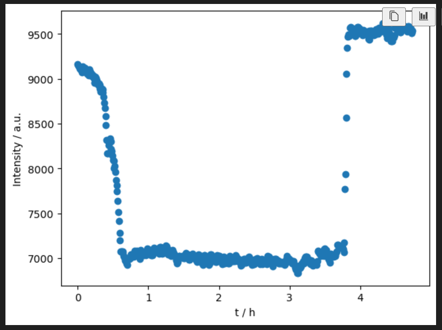
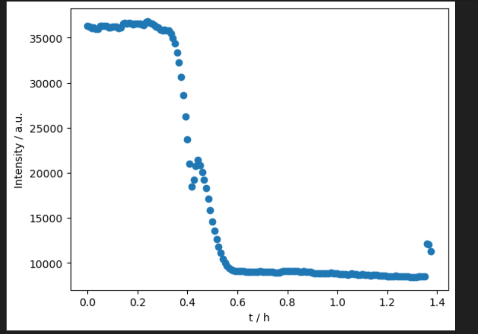

# Integrating data
use the json config file called "second_config_averaged.json" in /processed/
we created a new poni with LaB6, which was averaged over a 5 minute measurement, and a new mask

after integration you can move all the integrated .dat files with the command line "mv *.dat ../../processed/FMue_XX" while you are in the directory of the processed files

moving integrated files after FileZilla into this folder for plotting, makes it easier for later understanding when back in AquisGranaPadano
right now i have them in ./Desy_processed/

### Logbook 2
Just started FMue-2 third run and opened a new Logbook for the second day + night shift

**FMue-2**
Started the measurement at 8:52
nothing changed only the wire was a bit loose at the connecting luster terminal

10:35 starting cooling down to 350 °C
350 reached at 10:53 (frame 242), then starting flushing with He for 15 minutes 
integration of the measured sample shoed a really high backround. We stopped the measurement and decided to move the collimator closer to the sample and also the beam stop to around 15 cm (beamstop-sample distance) to still get a Qmin of hopefully around 0.4. 

new test measurement looks better, we got less underground (less airscattering id assume)
we didnt change anything about the sample detector distance and stuff so in general it should all work with the same poni file
we still moved all the measured stuff into an "old_setup" folder and will now put all new measurements in the raw folder

###
12:09 we started again to heat FMue-2 to 350 with He flow
12:55 starting pure hydrogen flow 7.5 ml/min
13:18 we do not see any obvious changes anymore in the xrd gonna wait for 10 more minutes
13:42 nothing is changing anylonger
gonna heat up to 450 °C (10° / min) with He flow and go on with reduction
14:03 450°C reached, switching to H2 flow 7.5 ml/min, image 227
14:13 no big changes visible in the XRDs
Co peaks forming slowly, e.g. at 3.75 A

15:50 we found the laptop turned it self off and the connection failed...
MFC's were turned off, heating was going on
Co reoxidized tho
canceling experiment at this point in time

    
    
<em>Figure 1: Screenshot of Synoptic overview</em>

Realligning beamstop since its not perfectly centered
###

**empty capillary**
16:39 10 images a 30s 

**LaB6**
also realligning the Y-Position = 250.554
16:56 10 images a 30s

**Si**
17:08 10 images a 30s

**empty heatcell**
17:20 10 images a 30s 

**FMue 3**
17:46 the sample is in and we had a flow of 33.7 of He. Flow changed when putting onn the Heatshield, this was fixed when screwing tight the moveable arme (where the capillary and the thermal controller are in).
17:53 measurement started, 17:54 temp ramp started 5° / min and Airflow or 3ml/min

19:24 (frame 180) 450°C were reached.

Temperature is quite stable right now with only ~60% power of the Eurotherm at 450 °C
600 °C should therefore be possible if required

Start to flush He at 21:17 (scann 406).
ramp to 350°C Started at scann 439.
H2 start to flush at 21:40 scann number 451.
the reduction seems to be really fast:

    
    
<em>Figure 1: Screenshot of FMue_3 first reduction (peak at 4.2)</em>

The reduction run for 2h, at 23:50 we started the ramp untill 450°C (scan 711).

scann 732 reach 450°C.

The reduction is still really slow, after 2h it didn't reach the plateau.

Scann1028 is the last scann at 450°C, we set a ramp untill 600°C (time 02:30).

The thermal controller is at 100% of the power and the temperature in the cell is of 490°C.

We decided to stop (scann 1079) and continue with the next sample.

He started to flush from scann 1075

**FMue 4**

Start the measurement at 3:17, the sistem was immidately tight again, we are the fucking boss (magic hands).

Ramp start at 3:18 (scann 1).

The analysis was stopped, problem with the thermocouple and the MFCs.

we are not understanding why for He and Air we are not able to reach 100% of the flow but only oround 60%.

We are running the experiment by starting directly at 450°C since the calcination was basically done (see fig below).

    
    
<em>Figure 1: Screenshot of FMue_4 calcination (first run peak at 0.8)</em>

The MFC for air is not going above 65-70%.

We decided to run the experiment in any case.

The flow is decreasing constantly, according to Wikipedia it can be a low pressure from the gas bottle.

We reset the MFCs at scann 30.

The problem still be present.

The flow is constantly decreasing.

We decided to start woth H2 after approximately 1h.
He is started to flush at scann 106 (6:07) and the ramp to 350 start.

350°C reach at scann 127.

H2 start to flush at scann 138 (6:22).

The MFC's problem should be related to the air and He line, the H2 flow is constant at 100%.

The major problem is on the Air line because the flow decrease untill 33%, while He was kind of constant around 70%.

Start the ramp to 450°C at 6:55 (scann 202).
450°C reached at scann 227.

