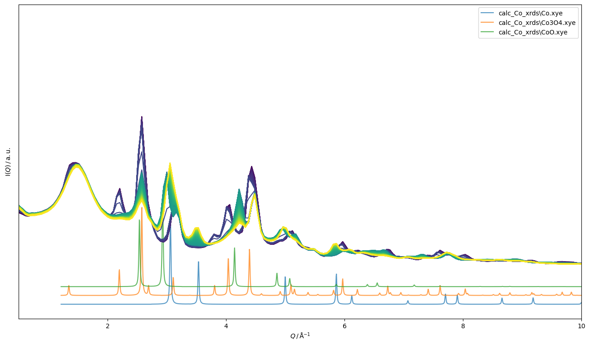

Just started FMue-2 third run and opened a new Logbook for the second day + night shift

**FMue-2**
Started the measurement at 8:52
nothing changed only the wire was a bit loose at the connecting luster terminal

10:35 starting cooling down to 350 °C
350 reached at 10:53 (frame 242), then starting flushing with He for 15 minutes 
integration of the measured sample shoed a really high backround. We stopped the measurement and decided to move the collimator closer to the sample and also the beam stop to around 15 cm (beamstop-sample distance) to still get a Qmin of hopefully around 0.4. 

new test measurement looks better, we got less underground (less airscattering id assume)
we didnt change anything about the sample detector distance and stuff so in general it should all work with the same poni file
we still moved all the measured stuff into an "old_setup" folder and will now put all new measurements in the raw folder

###
12:09 we started again to heat FMue-2 to 350 with He flow
12:55 starting pure hydrogen flow 7.5 ml/min
13:18 we do not see any obvious changes anymore in the xrd gonna wait for 10 more minutes
13:42 nothing is changing anylonger
gonna heat up to 450 °C (10° / min) with He flow and go on with reduction
14:03 450°C reached, switching to H2 flow 7.5 ml/min, image 227
14:13 no big changes visible in the XRDs
Co peaks forming slowly, e.g. at 3.75 A

15:50 we found the laptop turned it self off and the connection failed...
MFC's were turned off, heating was going on
Co reoxidized tho
canceling experiment at this point in time

    
    
<em>Figure 1: Screenshot of Synoptic overview</em>

Realligning beamstop since its not perfectly centered
###

**empty capillary**
16:39 10 images a 30s 

**LaB6**
also realligning the Y-Position = 250.554
16:56 10 images a 30s

**Si**
17:08 10 images a 30s

**empty heatcell**
17:20 10 images a 30s 

**FMue 3**
17:46 the sample is in and we had a flow of 33.7 of He. Flow changed when putting onn the Heatshield, this was fixed when screwing tight the moveable arme (where the capillary and the thermal controller are in).
17:53 measurement started, 17:54 temp ramp started 5° / min and Airflow or 3ml/min
